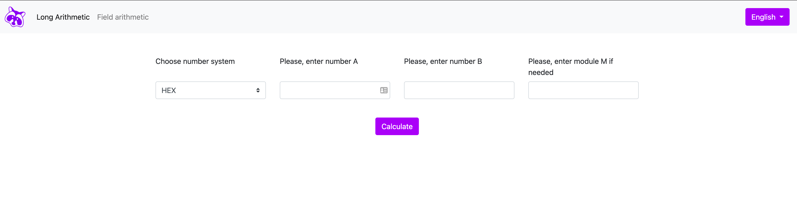

# SROM Lab Check Portal

A web application for validating student implementations of long arithmetic and finite field operations. Built for the Software Reliability and Optimization Methods (SROM) course at KPI Ukraine.

**Live Demo**: https://srom-check-1046503052627.europe-west1.run.app



## Features

- **Long Arithmetic Validation**: Check implementations of arbitrary-precision arithmetic operations
  - Addition, subtraction, multiplication, division
  - Modular arithmetic operations
  - GCD and LCM calculations
  - Support for different number systems

- **Finite Field Arithmetic**: Verify finite field operations
  - Polynomial basis support
  - Field arithmetic operations
  - Multiple field variants

- **Multi-language Support**: Interface available in Ukrainian and English

## Technology Stack

- Java 21
- Spring Boot 3.2.5
- Thymeleaf templating
- Gradle build system
- Docker support

## Getting Started

### Prerequisites

- Java 21 or higher
- Gradle 8.7+ (or use the included wrapper)

### Running Locally

```bash
# Build the project
./gradlew build

# Run the application
./gradlew bootRun
```

The application will be available at `http://localhost:8080`

### Running Tests

```bash
./gradlew test
```

### Running with Docker

```bash
# Build the Docker image
docker build -t srom-check-portal .

# Run the container
docker run -p 8080:8080 srom-check-portal
```

## Deployment

The application is configured for deployment on cloud platforms (Cloud Run, Heroku, etc.) with:
- Multi-stage Docker build for optimized image size
- Configurable port via `PORT` environment variable
- Production-ready security configurations

### Environment Variables

- `PORT`: Application port (default: 8080)
- `JAVA_OPTS`: JVM options (default: `-Xmx512m -Xms256m`)

## Development

### Code Formatting

This project uses Google Java Format via Spotless:

```bash
# Check formatting
./gradlew spotlessCheck

# Apply formatting
./gradlew spotlessApply
```

### Project Structure

```
src/
├── main/
│   ├── java/ua/kpi/srom/
│   │   ├── config/          # Application configuration
│   │   ├── controllers/     # Web controllers
│   │   ├── converters/      # DTO converters
│   │   ├── dto/             # Data transfer objects
│   │   ├── models/          # Domain models
│   │   ├── services/        # Business logic
│   │   ├── utils/           # Utilities
│   │   └── validators/      # Input validators
│   └── resources/
│       ├── static/          # Static assets
│       ├── templates/       # Thymeleaf templates
│       └── application.properties
└── test/                    # Test files
```

## License

Educational project for KPI Ukraine